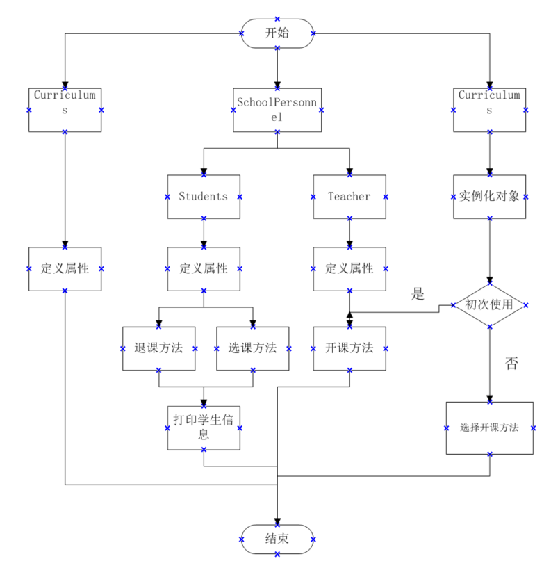

# 实验三 继承关系

#### 实验目的
掌握权限访问控制修饰符的使用； 掌握继承的使用。

#### 实验要求

1.保持实验二的代码和readme版本不变；

2.新建代码仓库，在实验二代码的基础上完成本次实验；

3.业务过程同实验二，但在类的设计上，采用父类-子类的继承关系定义。

4.测试实体类分别存放于不同的package中，验证权限访问控制、继承后属性及方法的可见性。


#### 实验思路

1.首先观察代码，发现已定义的三个类（教师，学生和课程类）中，教师和学生类中有大部分属性都是相同的，因此，可以通过创造一个学校成员类作为父类，定义他们共同的属性;

2.在父类中定义的构造方法子类无法直接使用，因此还需要使用super语句调用父类的构造方法完成教师以及学生类的对象实例化。

3.根据要求将测试类与属性类放在不同的包中，此时属性类已经无法正常被测试类检测到，即无法被调用，需要使用import语句调用存放属性类的包中的java文件。

4.根据课上所学知识将程序入口处设置分割线以及界面的方法改为静态方法，通过此修改后可以直接通过类调用，不需再创建实例对象调用。

5.测试代码功能，结束。

#### 流程图


#### 关键代码

继承语句

```
public class Students extends SchoolPersonnel { // 学生类

public class Teachers extends SchoolPersonnel { // 教师类
```

子类通过super()方法调用父类构造函数

```
public Students(int number, String name, String sex, Curriculums[] curriculums) {
        super(number, name, sex, curriculums);
    }
```

```
 public Teachers(int number, String name, String sex, Curriculums[] curriculums) {
        super(number, name, sex, curriculums);
    }
```

通过import语句调用

```
import SchoolSubjects2.Curriculums;
import SchoolSubjects2.Students;
import SchoolSubjects2.Teachers;
```

```
import SchoolSubjects2.*;
```


#### 程序运行截图


#### 感想与体会
通过本次实验，使用继承的方法对代码进行了修改，减少了代码的缀余，提高了代码的运行速率，使程序整体的逻辑性更加清晰，使代码更加简洁明了，可读性提高。这些学习经验对我的编写java代码产生了很大帮助。